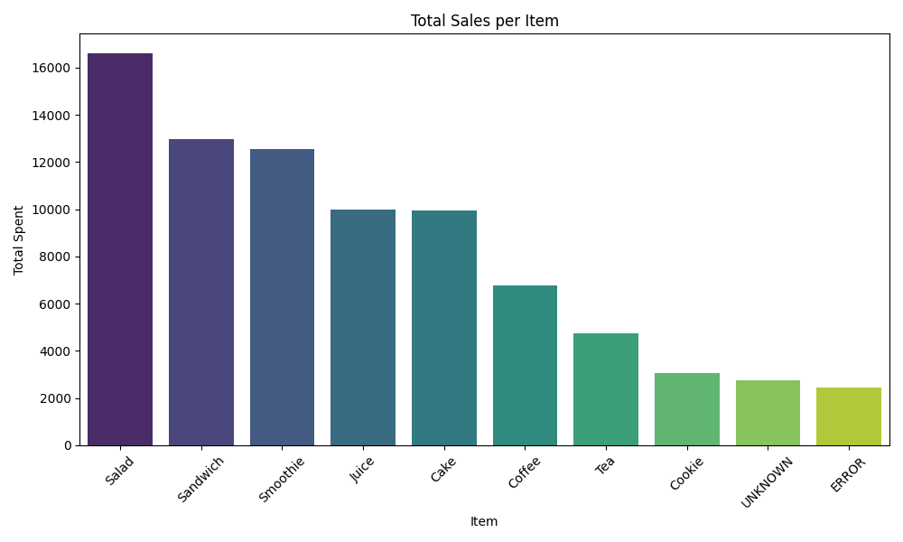
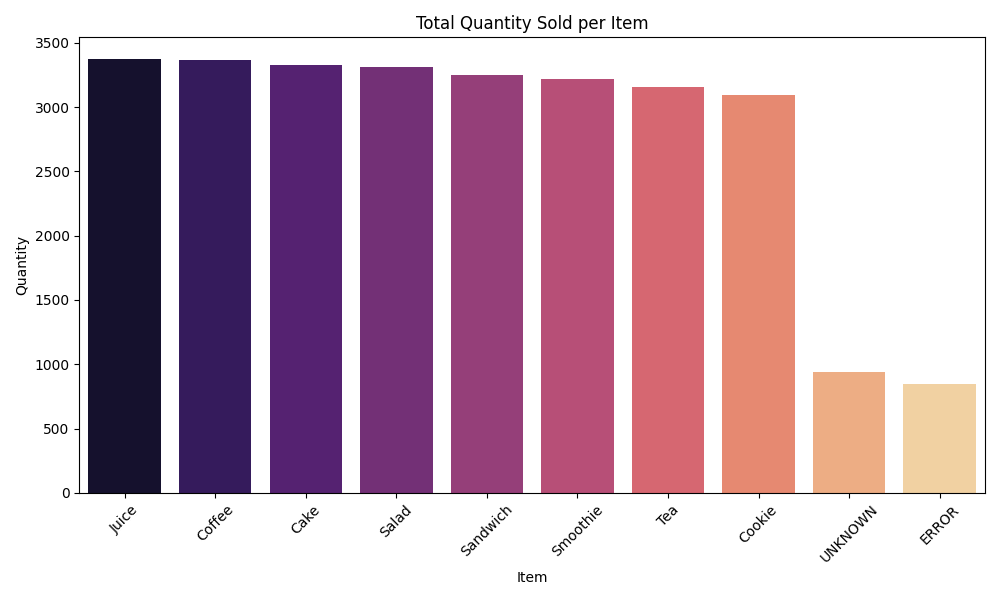
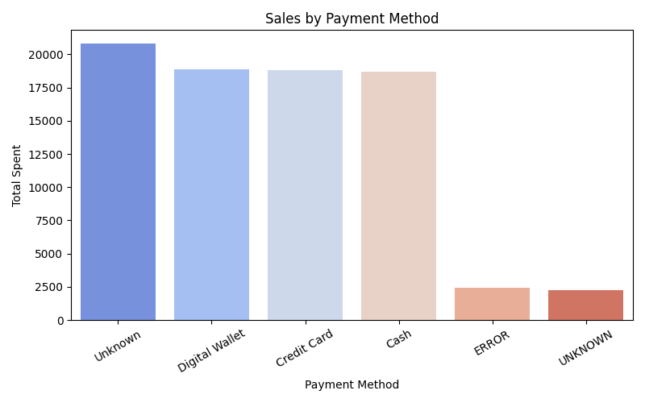
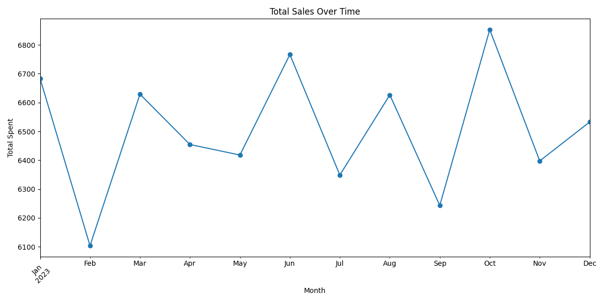
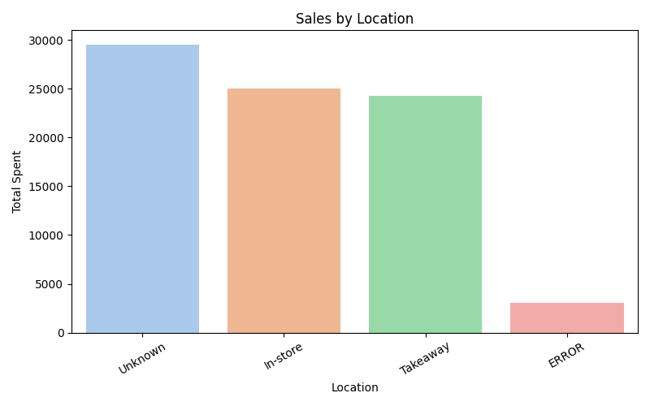

# Café Sales Analysis

## Overview
This project analyzes café sales data using Python, Pandas, and Seaborn/Matplotlib. 
The goal is to explore sales trends, understand customer behavior, and visualize key metrics from a messy dataset.

## Features
- Cleaned messy dataset
- Converted numeric and date columns
- Handled missing values
- Explored data using visualizations:
  - Total sales per item
  - Quantity sold per item
  - Sales by payment method
  - Sales by location
  - Sales trends over time

## How to Run
1. Activate the virtual environment:
2. Install required packages:
3. Run the analysis:

Plots will be saved automatically in the project folder.

## Next Steps / Improvements
- Build interactive dashboards using Plotly 
- Add predictive analysis to forecast sales
- Explore correlations between items, prices, and locations
- Implement more advanced data cleaning techniques to handle missing or inconsistent data---

 ## Insights from the Analysis

- **Juice** is the most purchased item with **1171 transactions**, followed closely by **Coffee (1165)** and **Salad (1148)**.  
- **Cake**, **Sandwiches**, **Smoothies**, and **Cookies** also rank high in popularity.  
- The presence of **‘UNKNOWN’** and **‘ERROR’** categories indicates missing or misentered data that could be cleaned further.  
- The café’s top sales come from both beverages and light meals, suggesting customers prefer a mix of quick bites and drinks.

  ---

## Visualizations

### Total Sales per Item

### Quantity Sold per Item

### Sales by Payment Method

### Sales Over Time

### Sales by Location

